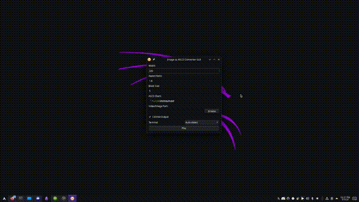
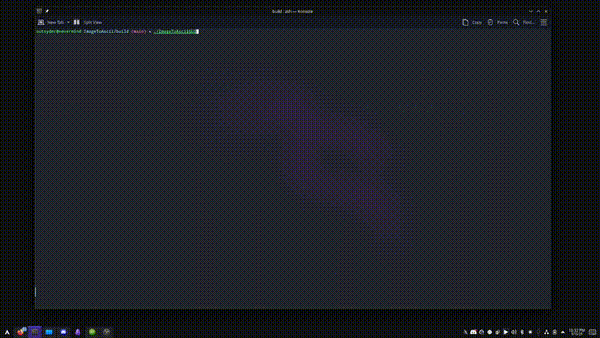

# ImageToAscii

ImageToAscii é um programa escrito em C++ que converte imagens e vídeos em representações ASCII art. O programa usa OpenCV para manipulação de imagens e CMake para gerenciamento de dependências.

## Funcionalidades
- Conversão de imagens para ASCII art
- Conversão de vídeos para ASCII art quadro a quadro
- Suporte a diferentes resoluções e ajustes de brilho
- Configuração personalizável de caracteres ASCII

## Tecnologias Utilizadas
- **Linguagem:** C++
- **Bibliotecas:** OpenCV
- **Gerenciador de Build:** CMake

## Como Compilar e Executar
### Requisitos
- CMake
- OpenCV instalado
- qt5-base e qt5-wayland instalado (opcional se quiser GUI)
- Compilador C++ (GCC, Clang, MSVC, etc.)

### Compilando o projeto

Dê permissão de run pro "install.sh":
```sh
 chmod +x install.sh

```
Rode o programa e selecione a instalação: (somente CLI, ou CLI e GUI juntas)
```sh
./install.sh

```

### Executando o programa

```sh
./ConvertImageToAscii 
ou 
./ImageToAsciiGUI
```

## Exemplo:
### User Interface: 
(only tested on arch linux)



### Command Line:


## Funcionalidades para adicionar:
- [x] Suporte pra imagem
- [x] Suporte pra videos
- [x] Cores Ansi para videos
- [x] Interface (temp)
- [x] Upload video/image
- [x] Cores ansi para fotos
- [x] Otimização de buffers
- [x] Interface grafica - GUI

## Licença
Este projeto está licenciado sob a [MIT License](LICENSE).


