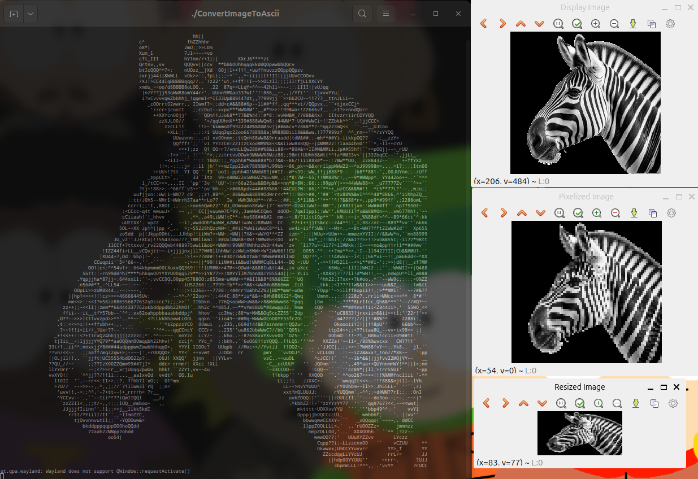

# ImageToAscii

ImageToAscii é um programa escrito em C++ que converte imagens e vídeos em representações ASCII art. O programa usa OpenCV para manipulação de imagens e CMake para gerenciamento de dependências.

## Funcionalidades
- Conversão de imagens para ASCII art
- Conversão de vídeos para ASCII art quadro a quadro
- Suporte a diferentes resoluções e ajustes de brilho
- Configuração personalizável de caracteres ASCII

## Tecnologias Utilizadas
- **Linguagem:** C++
- **Bibliotecas:** OpenCV
- **Gerenciador de Build:** CMake

## Como Compilar e Executar
### Requisitos
- CMake
- OpenCV instalado
- Compilador C++ (GCC, Clang, MSVC, etc.)

### Compilando o projeto

Crie o diretorio e entre nele:
```sh
 mkdir build
 cd build

```
Dentro do diretorio "build", execute cmake 
```sh
cmake ..

```

Após configuração bem-sucedida, compile o projeto:
```sh
make

```

ou

```sh
 cd .. && cmake --build cmake-build-debug --target ConvertImageToAscii -j 10

```

### Executando o programa

```sh
./ConvertImageToAscii
```

## Exemplo:
### Saída: 


## Funcionalidades para adicionar:
- [x] Suporte pra imagem
- [x] Suporte pra videos
- [x] Cores Ansi para videos
- [x] Interface (temp)
- [x] Upload video/image
- [x] Cores ansi para fotos
- [ ] Otimização do programa (multi thread)
- [ ] Otimização de buffers
- [ ] Suporte a GPU Nvidia CUDA (not sure)
- [ ] Interface grafica - GUI

## Licença
Este projeto está licenciado sob a [MIT License](LICENSE).


